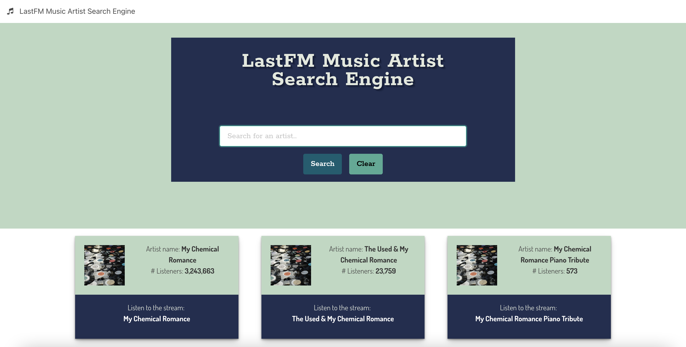

# LastFM Music Artist Search Engine

## Description

This project was bootstrapped with [Create React App](https://github.com/facebook/create-react-app). This application allows
users to search for musical artists. Created using [LastFM API](https://www.last.fm/api).

## Table of Contents
* [Technology Stack](#technology-stack)
* [Screenshot](#screenshot)
* [Deployed Page](#deployed-page)
* [License](#license)

## Technology Stack

## Screenshot

## Deployed page

[View Published Page](https://erin-m-keller.github.io/keller-lastfm/)

## License

